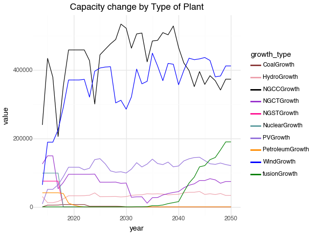

# Fusion Deployment Simulation

This library is a python port of the simulation code originally written in R for the paper
_Characterizing fusion market entry via an agent-based power plant fleet model_ by Spangher, Vitterb, and Umstattda 
[ARPAE Link](https://arpa-e.energy.gov/technologies/publications/characterizing-fusion-market-entry-agent-based-power-plant-fleet-model).

## Install Python 3

Navigate to [Python Downloads](https://www.python.org/downloads/) and install at least version 3.9.

## Install dependencies with pip & venv

We use [python venv]() and [pip]() to manage dependencies.

Mac & Linux Commands
```bash
# remove existing environment (on clean up)
rm -rf venv

# create virtual environment (on new environment)
python3 -m venv venv

# activate virtual environment (on new terminal)
source venv/bin/activate

# deactivate virtual environment (after activating)
deactivate

# install dependencies (on new environment or after changes)
pip install -r requirements.txt
```

Windows Commands
```bash
# remove existing environment (on clean up)
rm -rf venv

# create virtual environment (on new environment)
python3 -m venv venv

# activate virtual environment (on new shell)
venv\Scripts\activate

# install dependencies (on new environment or after changes)
pip install -r requirements.txt
```

## Download data files

Data files are located in [Google Drive](https://drive.google.com/drive/folders/1O7q-9J_2qYRtgbwDxbOpgZETMU3DMRrh?usp=drive_link).
Please download and add them to the `python/data` directory.

## Download US Counties Data

Just once you'll need to run the following script to download geo data to `data/us_geo` directory:

```
python3 download_us_geo_data.py
```

Note you'll need to be on a VPN to the USA if you're outside the USA.

# Running the simulation

## Dataprep

You'll need to process the data/ files into the out/ structures before running a simulation.

In the activated venv run:
```
python dataprep.py
```

## Simulate

The run.py script demonstrates running one simulation with output to `out/run`, 
you can copy and paste this to run different simulations.

```
python run.py
```

## Simulation

This command will run all simulations with output to `out/simulate`.

```
python simulation.py
```

## Save Capacity Change Graph

There's a script utility for generating the following graph given any simulation_summary.csv.



Run the following (default parameters draw output from `run.py`):
```
python plot_capicity_change.py --input_csv=SUMMARY_CSV --out_dir=... --filename=... --start_year=... --end_year=...
```